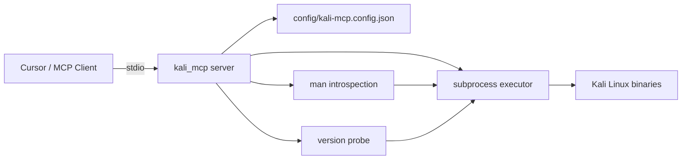
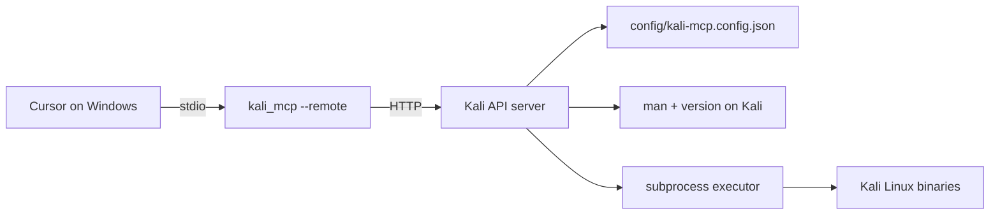

# Kali MCP

Config-driven [Model Context Protocol](https://modelcontextprotocol.io/) server that exposes Kali Linux tools to AI agents (Cursor, Claude Desktop, etc.) using declarative JSON configuration — similar to how [Data API Builder (DAB)](https://learn.microsoft.com/en-us/azure/data-api-builder/) loads SQL Server entities from `dab-config.json`.

Built for the UMSS Diplomado en Ciberseguridad monografía: *Pruebas de penetración asistidas por agente de inteligencia artificial al portal web de la FCAPyF*.

## Key idea

| DAB (C#) | Kali MCP (Python) |
|----------|-------------------|
| `dab-config.json` declares SQL entities | `kali-mcp.config.json` declares CLI tools |
| Runtime exposes REST endpoints | Runtime exposes MCP tools |
| Schema from database metadata | Schema from JSON + `man` + `--version` |

You **declare which tools exist** in JSON. At startup (or on demand), the server enriches each tool with:

- **Man page** synopsis, description, and option summary (`man` on the Kali host)
- **Installed version** (`--version`, `-V`, etc.)
- **Binary path** (`which`)

No hardcoded per-tool Python endpoints — add `nikto`, `wpscan`, or `zap` by editing the config file.

## Architecture

### Local mode (MCP and tools on same Kali host)



### Remote mode (Cursor on Windows -> Kali VM)



Recommended: SSH tunnel so the API stays bound to `127.0.0.1` on Kali.

## Quick start (Kali Linux VM)

```bash
cd kali-mcp
python3 -m venv .venv
source .venv/bin/activate
pip install -r requirements.txt

# Option A: MCP server locally on Kali (Cursor also on Kali)
python -m kali_mcp --config config/kali-mcp.config.json

# Option B: HTTP API for remote Windows clients
python -m kali_mcp.api --config config/kali-mcp.config.json --host 127.0.0.1 --port 5000
```

## Windows -> Kali setup (recommended)

### 1. Start API on Kali

```bash
cd kali-mcp
source .venv/bin/activate
python -m kali_mcp.api --config config/kali-mcp.config.json --host 127.0.0.1 --port 5000
```

### 2. Open SSH tunnel from Windows

```powershell
ssh -L 5000:127.0.0.1:5000 user@KALI_IP
```

Keep this terminal open. Traffic to `localhost:5000` on Windows is forwarded to Kali.

### 3. Configure Cursor on Windows

Use `cursor-mcp.remote.example.json`:

```json
{
  "mcpServers": {
    "kali-mcp-remote": {
      "command": "python",
      "args": [
        "-m",
        "kali_mcp",
        "--config",
        "F:/diplo/trabajo-final/kali-mcp/config/kali-mcp.config.json",
        "--remote",
        "http://127.0.0.1:5000"
      ]
    }
  }
}
```

Install deps on Windows too:

```powershell
cd F:\diplo\trabajo-final\kali-mcp
python -m venv .venv
.venv\Scripts\pip install -r requirements.txt
```

Point Cursor's `command` to `.venv\Scripts\python.exe` if needed.

### Verify connectivity

```powershell
curl http://127.0.0.1:5000/health
```

You should see JSON with `status: healthy` and the tool count from Kali.

## Quick start (local MCP on Kali only)

```bash
cd kali-mcp
python3 -m venv .venv
source .venv/bin/activate
pip install -r requirements.txt

# Start MCP server (stdio) with default config
python -m kali_mcp --config config/kali-mcp.config.json
```

### Cursor configuration

Copy `cursor-mcp.example.json` into your Cursor MCP settings and adjust the `--config` path:

```json
{
  "mcpServers": {
    "kali-mcp": {
      "command": "python",
      "args": [
        "-m",
        "kali_mcp",
        "--config",
        "/absolute/path/to/kali-mcp/config/kali-mcp.config.json"
      ]
    }
  }
}
```

Run the server **on the Kali VM** where the tools are installed, or use **remote mode** with the API server + SSH tunnel when Cursor runs on Windows.

## Configuration

See `config/kali-mcp.config.json` for the FCAPyF pentest toolset:

| Tool | Binary | PTES phase |
|------|--------|------------|
| `nmap_scan` | nmap | Reconnaissance |
| `whatweb_fingerprint` | whatweb | Reconnaissance |
| `sslscan_probe` | sslscan | Vulnerability analysis |
| `nikto_scan` | nikto | Vulnerability analysis |
| `wpscan_analyze` | wpscan | Vulnerability analysis |
| `gobuster_scan` | gobuster | Vulnerability analysis |
| `curl_request` | curl | Exploitation / validation |
| `run_command` | bash | Fallback utility |

### Adding a tool (DAB-style)

Add an entry to the `tools` array — no Python changes required:

```json
{
  "name": "ffuf_fuzz",
  "binary": "ffuf",
  "category": "web",
  "description": "Fast web fuzzer",
  "parameters": [
    {
      "name": "url",
      "description": "Target URL with FUZZ keyword",
      "type": "string",
      "required": true,
      "flag": "-u",
      "argStyle": "kv"
    },
    {
      "name": "wordlist",
      "description": "Wordlist path",
      "type": "string",
      "default": "/usr/share/wordlists/dirb/common.txt",
      "flag": "-w",
      "argStyle": "kv"
    }
  ]
}
```

Restart the MCP server (or call `reload_tool_metadata`) to pick up config changes.

### Parameter `argStyle`

| Style | Behavior | Example |
|-------|----------|---------|
| `kv` | Flag + value | `-h`, `target` → `-h target` |
| `flag` | Boolean flag | `-i` when true |
| `positional` | Positional arg | `nmap 10.0.0.1` |
| `append` | Raw tokens appended | `-sV -sC` |

Every tool also accepts `additional_args` (unless disabled) for extra CLI flags as a single string.

## Auto-discover installed tools (generate JSON)

Run on **Kali Linux** to scan installed binaries and build `kali-mcp.config.json` automatically. Discovery uses:

1. **Curated catalog** — common pentest tools checked via `which`
2. **`dpkg-query`** — binaries from installed Kali packages
3. **`man -k` scan** (optional) — broader keyword-based discovery
4. **`man` introspection** — descriptions and parameter hints at generation time

### CLI (on Kali)

```bash
# Generate a fresh config from everything installed
python -m kali_mcp.discover --pretty

# Write to a specific file
python -m kali_mcp.discover -o config/kali-mcp.generated.json

# Only web + recon tools
python -m kali_mcp.discover --category web,reconnaissance

# Merge new tools into your existing config (skip duplicates by binary)
python -m kali_mcp.discover --merge config/kali-mcp.config.json -o config/kali-mcp.config.json

# Print JSON to stdout
python -m kali_mcp.discover --stdout --pretty
```

### From Windows (via remote API on Kali)

```powershell
curl -X POST http://127.0.0.1:5000/api/config/discover `
  -H "Content-Type: application/json" `
  -d "{\"categories\":[\"web\",\"reconnaissance\"]}"
```

Or ask the MCP agent to call `generate_config_from_installed_tools` — in remote mode this delegates to Kali.

### Discovery CLI options

```bash
python -m kali_mcp.discover --help

  -o, --output PATH     Output JSON path
  --stdout              Print JSON to stdout
  --merge CONFIG        Merge into existing config
  --category LIST       Comma-separated categories
  --no-dpkg             Skip dpkg-based discovery
  --man-scan            Include man -k keyword scan
  --man-scan-limit N    Max tools from man scan
  --pretty              Print discovery summary JSON
```

## Built-in meta tools

| MCP tool | Purpose |
|----------|---------|
| `list_configured_tools` | Inventory from JSON + install/version status |
| `get_tool_documentation` | Full man metadata + configured parameters |
| `reload_tool_metadata` | Refresh man/version cache |
| `generate_config_from_installed_tools` | Auto-build JSON config from installed Kali tools |

## CLI options

### MCP server (`python -m kali_mcp`)

```bash
python -m kali_mcp --help

  --config PATH     Path to kali-mcp.config.json
  --remote URL      Kali API URL for Windows->Kali remote mode
  --timeout SECS    HTTP timeout when using --remote (default: 300)
  --debug           Verbose logging
  --no-warm-cache   Skip man/version pre-load at startup
```

### API server (`python -m kali_mcp.api`)

```bash
python -m kali_mcp.api --help

  --config PATH     Path to kali-mcp.config.json
  --host ADDR       Bind address (default: 127.0.0.1)
  --port PORT       Bind port (default: 5000)
  --debug           Flask debug mode
  --no-warm-cache   Skip man/version pre-load at startup
```

Bind to `0.0.0.0` only if you accept direct network exposure (not recommended; prefer SSH tunnel).

## Comparison with example-mcp

The reference [MCP-Kali-Server](example-mcp) project hardcodes Flask routes and MCP tool wrappers per utility. **Kali MCP** generalizes that pattern:

- **Before:** one Python function per tool (`nmap()`, `nikto()`, …)
- **After:** one registry loads N tools from JSON, enriches from `man`, executes via argv (no shell)

## Security

- Commands run with `shell=False` (argv list only)
- Safety instructions are injected into MCP server context
- `run_command` is a last-resort escape hatch — prefer dedicated tool entries
- Only use against targets you are authorized to test

## License

MIT — see [LICENSE](LICENSE).

## Disclaimer

For authorized security testing and academic research only.
