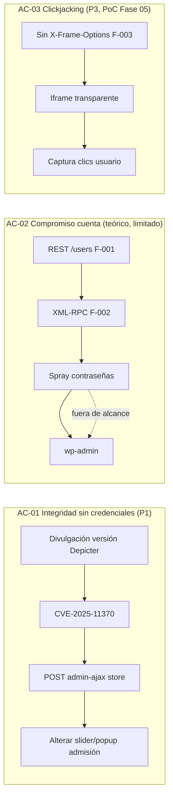

# Informe Fase 03 — Modelado de amenazas (PTES)

**Objetivo:** https://fcapyf.umss.edu.bo/  
**Analista:** Andres Joel Soliz Choque  
**Periodo:** 2026-07-17  
**Entrada:** Fase 02 (inteligencia) + hallazgos F-001–F-005 validados

---

## 1. Propósito

La Fase 03 traduce el inventario tecnológico en **escenarios de ataque plausibles** y una **matriz amenaza–activo priorizada**, conforme al diseño metodológico (Tabla 3, Cap. diseño metodológico) y al estándar PTES. Este documento **justifica el orden y alcance** de las pruebas de la Fase 04.

---

## 2. Perfil del adversario (ADV-01)

| Atributo | Valor |
|----------|-------|
| **Tipo** | Atacante externo anónimo |
| **Modalidad** | Caja negra — sin credenciales |
| **Ubicación** | Internet |
| **Motivación** | Alteración de contenido público, phishing, spam, daño reputacional |
| **Capacidades** | curl, WPScan, Nikto, CVE públicos, enumeración WordPress |

**Restricciones del engagement:** sin DoS, sin brute force masivo, sin `system.multicall` amplificado, sin pivot a red UMSS, sin wp-admin autenticado.

---

## 3. Activos críticos (CID)

| ID | Activo | Dimensión CID | Criticidad |
|----|--------|---------------|------------|
| AST-01 | Sliders/popups Depicter (admisión, homepage) | Integridad | **Crítica** |
| AST-02 | Cuentas WordPress | Confidencialidad | Alta |
| AST-03 | Core WP + Divi + plugins | Integridad | Alta |
| AST-04 | Confianza del visitante (UI embebible) | Confidencialidad | Media |
| AST-05 | Metadatos de versiones | Confidencialidad | Baja (habilitador) |

---

## 4. Escenarios de amenaza priorizados

| Prioridad | ID | Escenario | OWASP | Anónimo | Hallazgo |
|-----------|-----|-----------|-------|---------|----------|
| **1** | TS-01 | Modificación Depicter vía CVE-2025-11370 (AJAX `store`) | A01 | Sí | F-004 |
| **2** | TS-02 | REST users → auth XML-RPC/login (cadena teórica) | A07 | Parcial | F-001, F-002 |
| **2** | TS-05 | CVE dirigidos por versiones desactualizadas | A03 | Depende | F-005 |
| **3** | TS-04 | Clickjacking por cabeceras ausentes | A02 | Con interacción | F-003 |
| **4** | TS-03 | CSRF Depicter CVE-2025-8383 (admin engañado) | A01 | **No** | F-004 |

### Distinción metodológica TS-01 vs TS-03

- **TS-01:** explotable por adversario **sin sesión** — prioridad máxima en caja negra.
- **TS-03:** requiere administrador autenticado — **documentar**, no confundir con explotación anónima ni ejecutar PoC contra admin real.

---

## 5. Cadenas de ataque

---

## 6. Matriz amenaza–activo

| Activo | Amenaza principal | Riesgo | Fase de prueba |
|--------|-------------------|--------|----------------|
| AST-01 Depicter | TS-01, TS-03 | Crítico / Medio | 04 (validar), 05 (PoC TS-01) |
| AST-02 Cuentas | TS-02 | Alto | 04 (XML-RPC, rate limit) |
| AST-03 CMS/plugins | TS-05 | Medio | 04 (WPScan, Nikto) |
| AST-04 Visitantes | TS-04 | Medio | 05 (PoC clickjacking) |
| AST-05 Metadatos | TS-05 | Bajo | 04 (correlación CVE) |

---

## 7. Escenarios descartados (pruebas negativas de modelado)

| Escenario | Motivo |
|-----------|--------|
| DoS / fuzzing agresivo | Prohibido en reglas de engagement |
| Pivot red interna UMSS | Fuera de alcance |
| TLS downgrade SSLv3/TLS1.0 | Descartado en Fase 02 — TLS 1.2/1.3 únicamente |
| Diccionario completo post-enumeración | Fuera de proporcionalidad académica |

---

## 8. Plan de pruebas Fase 04 (derivado del modelado)

| Orden | Objetivo | Herramientas MCP | WSTG |
|-------|----------|------------------|------|
| **P1** | Confirmar CVE-2025-11370 en `admin-ajax.php` | `curl_run`, `wpscan_run` | ATHZ-01, ATHZ-02 |
| **P2** | Ampliar F-002: `system.listMethods` XML-RPC + rate limiting auth | `curl_run`, `wpscan_run` | CONF-06, IDNT-04 |
| **P3** | Inventario plugins/temas + Nikto + correlación CVE | `wpscan_run`, `nikto_run` | INFO-02, INFO-05 |
| **P4** | Cabeceras en rutas adicionales | `curl_run` | CONF-02 |

**Diferido a Fase 05:** PoC Depicter (TS-01) y PoC clickjacking (TS-04), con reversión documentada.

---

## 9. Conclusión

El modelado confirma que **TS-01 (Depicter CVE-2025-11370)** es el escenario de mayor impacto institucional en modalidad caja negra, seguido de la **cadena de autenticación** (TS-02) y la **cadena de suministro** (TS-05). La Fase 04 debe ejecutarse en ese orden, respetando las restricciones éticas del engagement.

*Artefacto JSON:* `phases/03-modelado-amenazas/artifact.json`
