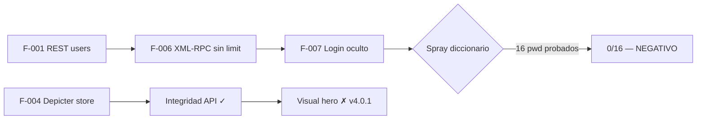

# Informe Fase 06 — Post-explotación (delimitación)

**Analista:** Andres Joel Soliz Choque  
**Periodo:** 2026-07-17 15:30 – 16:00 (-04)  
**Target:** https://fcapyf.umss.edu.bo/

---

## Objetivo

Delimitar la **profundidad real** del atacante anónimo en caja negra: capacidades logradas, límites del engagement, vectores negativos consolidados y verificación de reversión de PoCs.

---

## 1. Matriz de profundidad de ataque

| Capacidad | Estado | Hallazgo |
|-----------|--------|----------|
| Leer reglas Depicter (IDs 1–100) | ✓ | F-004 |
| Escribir reglas Depicter (docs 1, 17, 50) | ✓ PoC revertida | F-004 |
| Enumerar usuarios REST | ✓ | F-001 |
| Clickjacking homepage | ✓ PoC local | F-003 |
| Credenciales / wp-admin | ✗ | F-002, F-006, F-007 |
| Defacement visual hero doc 17 | ✗ | F-004 (limitación v4.0.1) |
| RCE / movimiento lateral | ✗ Out-of-scope | — |

Evidencia: `raw/attack-depth-matrix.json`

**Techo del atacante:** alteración de integridad en configuración Depicter + superficie ampliada (REST, XML-RPC, headers). **Sin compromiso de cuentas ni panel administrativo.**

---

## 2. Muestreo Depicter IDs 1–30

| Shape | IDs |
|-------|-----|
| `configured_always` | 1, 17 |
| `array_empty` | 2 |
| `object_empty` | 3–16, 18–30 |

- **Embed público:** solo doc **17** (`.depicter-17` en homepage).
- Inventario extendido 1–100: `phases/05-explotacion/raw/depicter-document-rules-inventory.json`
- Muestreo Fase 06: `raw/depicter-read-sample-ids-1-30.json`

---

## 3. Probes de escritura (alcance generalizado)

| Doc | Baseline | Probe | Revert | Evidencia |
|-----|----------|-------|--------|-----------|
| 1 | always | never → success | always ✓ | `raw/depicter-write-scope-doc1-probe.txt` |
| 17 | always | never → success | always ✓ | `phases/05-explotacion/raw/depicter-poc-doc17-revert.txt` |
| 50 | `{}` | never → success | `{}` ✓ | `raw/depicter-write-scope-doc50-probe.txt` |

**Conclusión:** la escritura no está limitada al hero; aplica a documentos vacíos y configurados.

---

## 4. Vectores negativos consolidados

| ID | Vector | Resultado |
|----|--------|-----------|
| NV-01 | `depicter-rules-store` (Atomic Edge) | `0` |
| NV-02 | Payload `conditions`/`settings` vía rules-store | `0` |
| NV-03 | Diccionario 16 pwd XML-RPC (edwinqm) | 0/16 |
| NV-04 | `wp-login.php` | 404 |
| NV-05 | `wp-config-sample.php` | 500 |
| NV-06 | Action `depicter-rules-show` | `0` |
| NV-07 | Impacto visual reglas en doc 17 embebido | Sin cambio |
| NV-08 | `system.multicall` masivo | No ejecutado (prohibido) |

Evidencia: `raw/negative-vectors-consolidated.json`

---

## 5. Inventario de hallazgos (F-001 – F-008)

| ID | Severidad | PoC | Profundidad post-explotación |
|----|-----------|-----|------------------------------|
| F-001 | Medium | No | Cadena teórica auth |
| F-002 | Medium | No | Superficie XML-RPC |
| F-003 | Medium | Sí (local) | Clickjacking cliente |
| **F-004** | **High** | **Sí (revertida)** | **Integridad Depicter — riesgo principal** |
| F-005 | Low | No | Version disclosure |
| F-006 | Medium | No | Sin rate limit; auth negativa |
| F-007 | Info | No | Login oculto |
| F-008 | Low | No | readme.html |

Evidencia: `raw/findings-inventory-matrix.json`

---

## 6. Cumplimiento de reversión

| Doc | Estado final verificado |
|-----|-------------------------|
| 1 | `[{"type":"always","options":{}}]` |
| 17 | `[{"type":"always","options":{}}]` |
| 50 | `{}` |

Evidencia: `raw/post-exploitation-state-verification.txt`  
Criterio `engagement-scope.md` § PoC: **CUMPLIDO**

---

## 7. Cadena teórica vs. demostrada

---

## 8. Observaciones para el informe final

1. **F-004** es el único hallazgo con impacto demostrado en **integridad** (CWE-862, CVE-2025-11370).
2. PoCs públicos genéricos **no aplican** en Depicter 4.0.1 FCAPyF.
3. El hero embebido no refleja cambios de reglas — el riesgo es **configuración almacenada** y futuros popups/overlays.
4. XML-RPC + enumeración REST configuran un escenario **teórico** de auth; no se demostró acceso.

---

## Siguiente fase

**07 — Informe:** inventario definitivo, CVSS, matriz de riesgo institucional, remediaciones Cap. IV, narrativa Cap. II.
